# My UI Showcase Portfolio

Welcome to my UI showcase! Here, you can explore the user interfaces I've designed for two of my projects: **Fitness** and **Foodly**. Below are the links to the repositories and screenshots of the UI.

## Fitness App

[View the project on GitHub](https://github.com/ShubhamKrishna0/fitness.git)

### Screenshots
Below are the screenshots of the Fitness app UI:

- 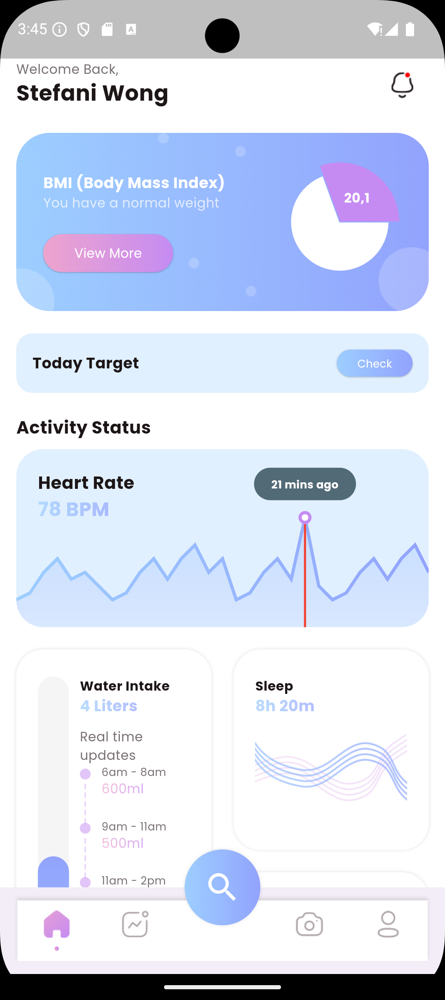
- 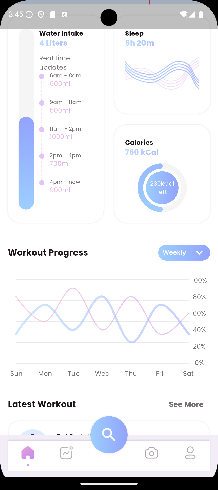
- 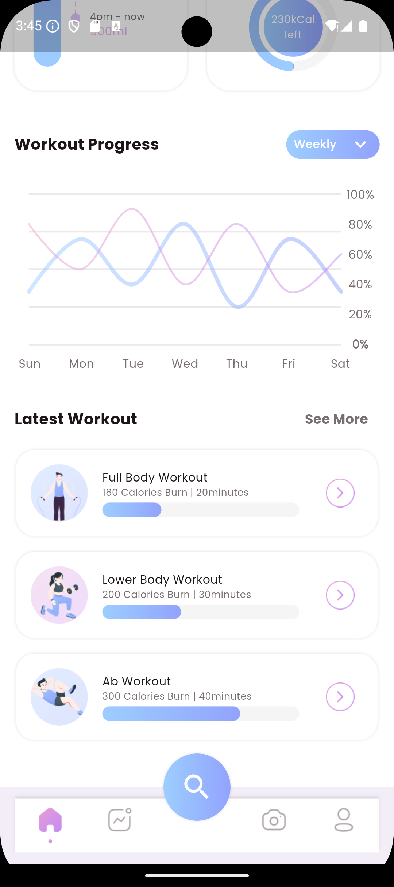
- 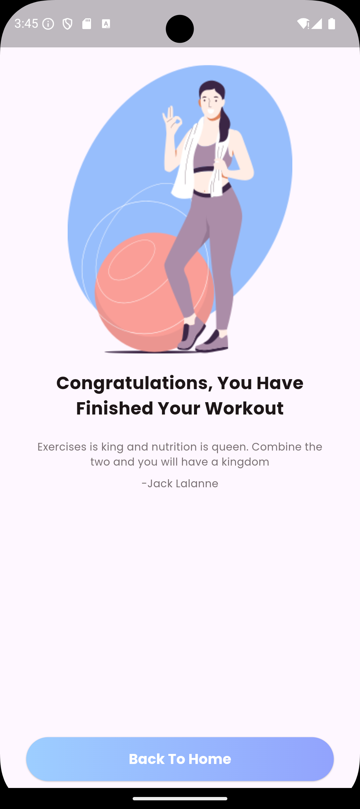
- 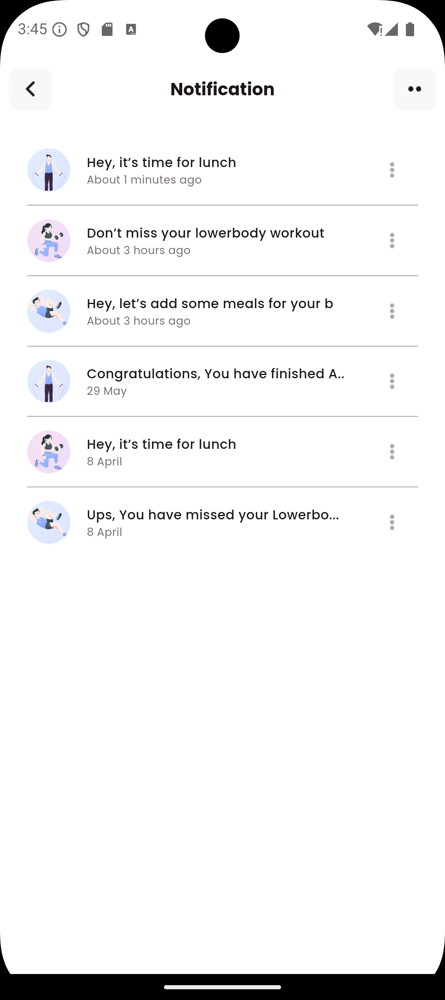
- 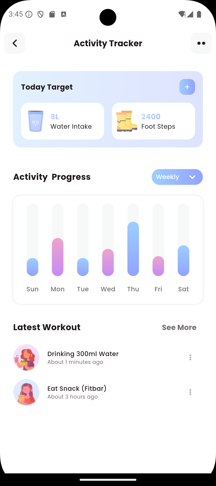
- 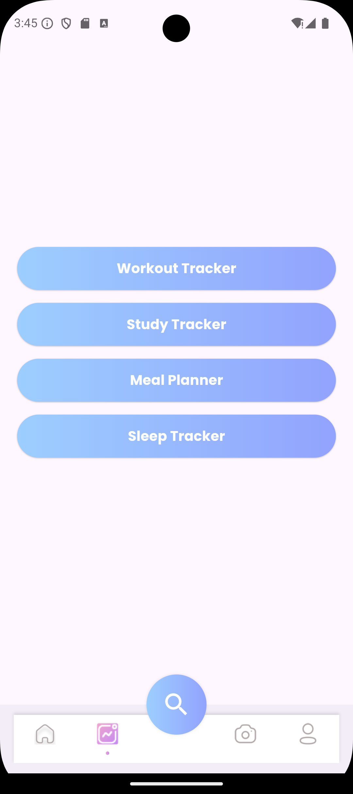
- 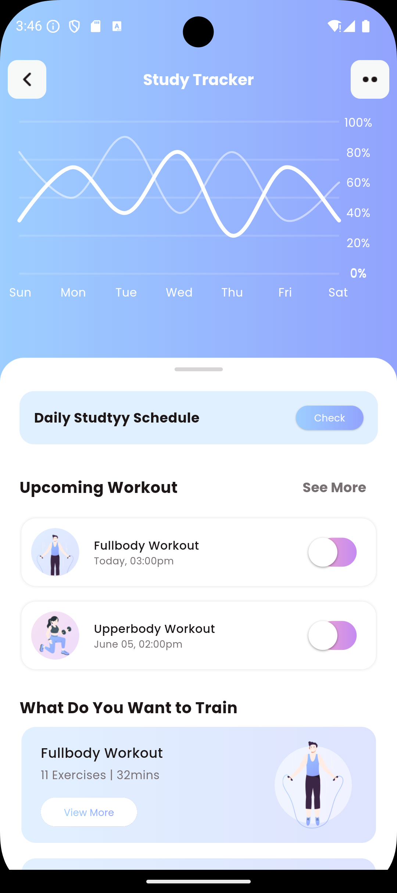
- 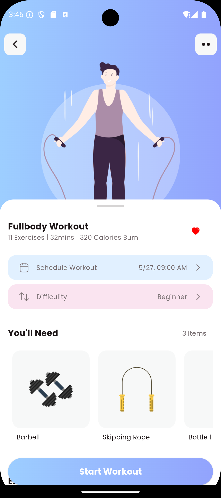
- 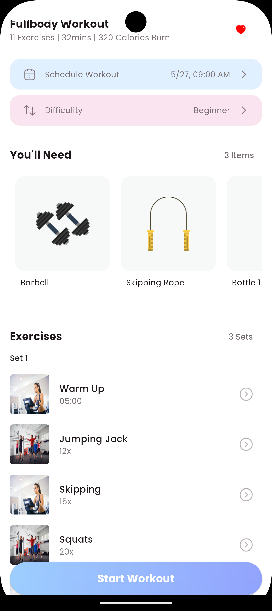
- 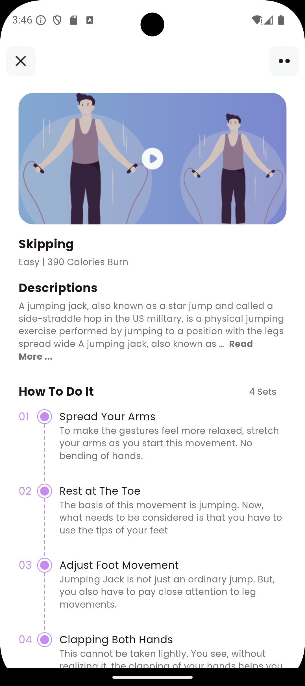
- 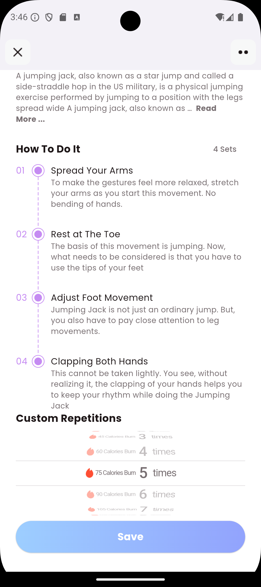
- 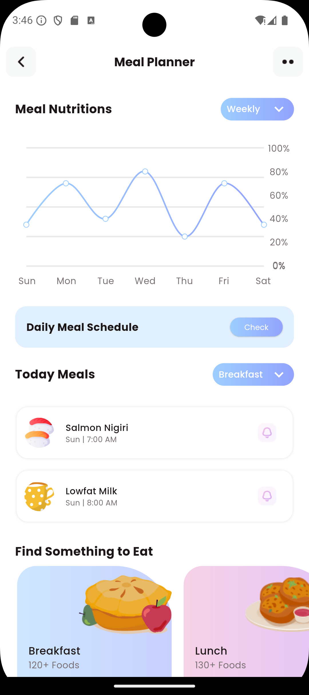
- 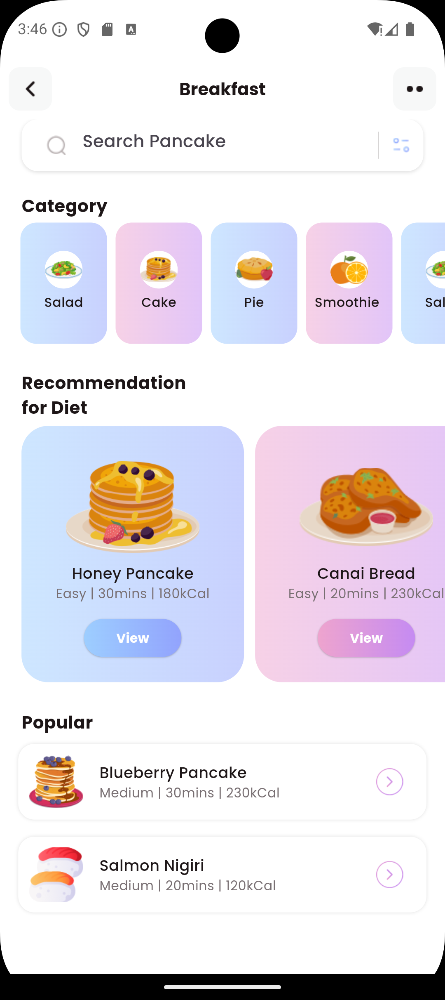
- 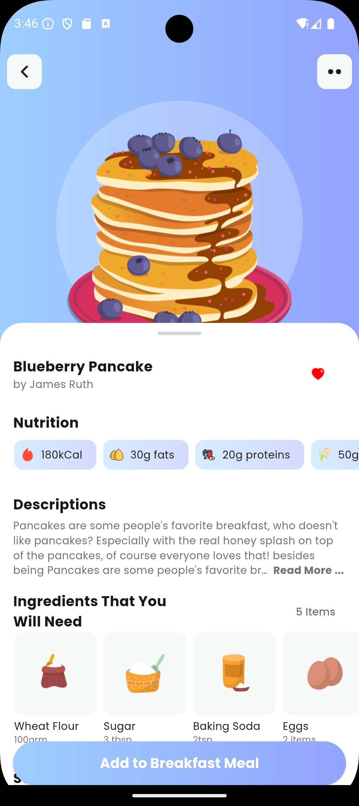
- 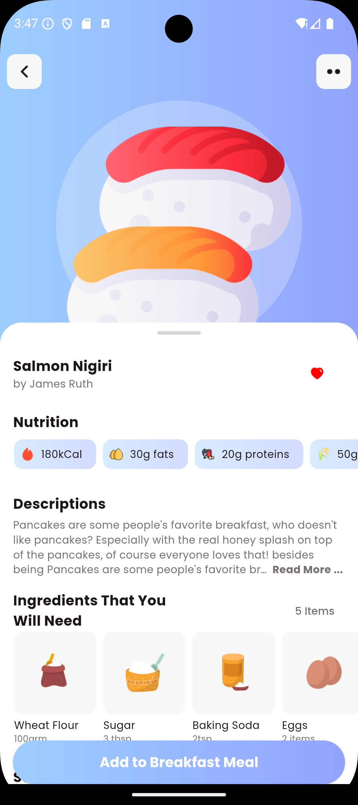
- 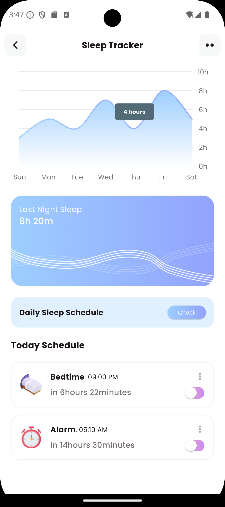
- 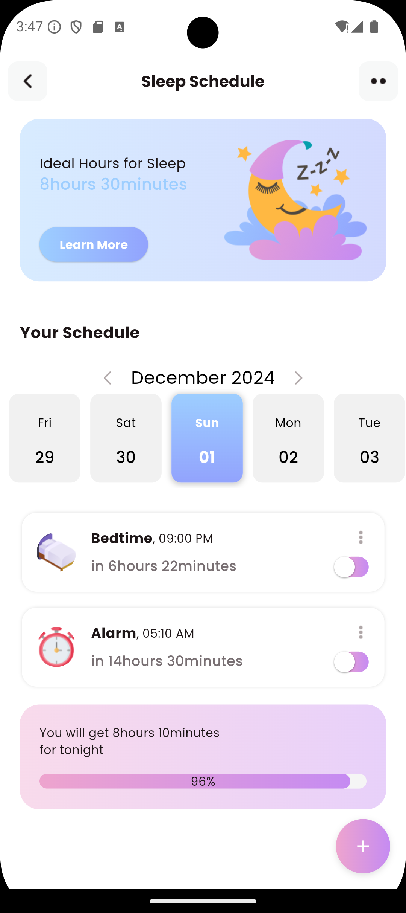
- 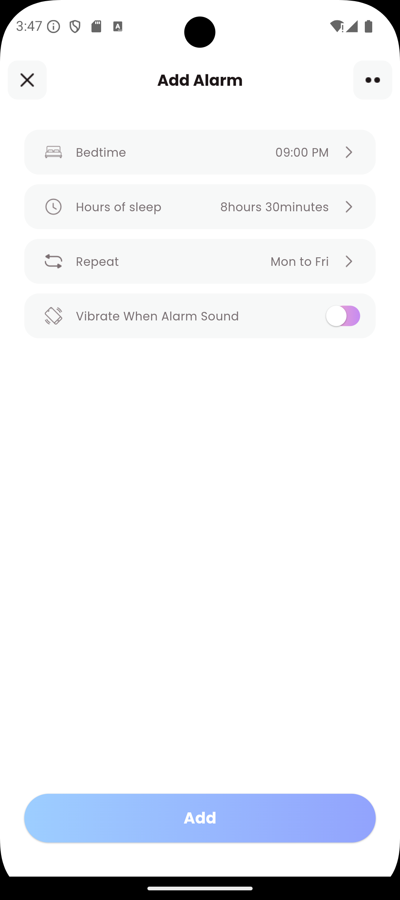
- 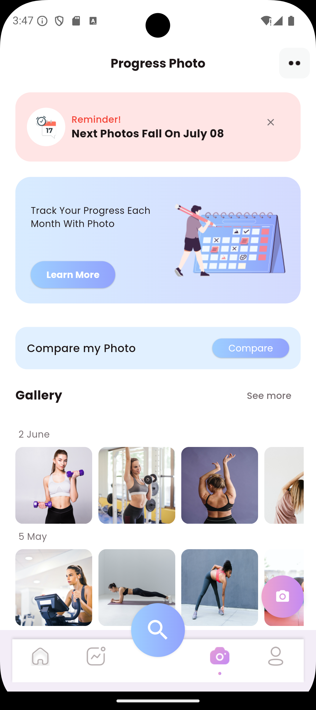
- 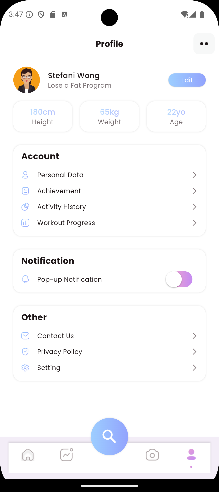

---

## Foodly App

[View the project on GitHub](https://github.com/ShubhamKrishna0/foodly_frontend.git)

### Screenshots
Below are the screenshots of the Foodly app UI:

- .png)
- .png)
- .png)
- .png)
- .png)
- .png)
- .png)
- .png)
- .png)
- .png)
- .png)
- .png)
- .png)
- .png)
- .png)

---

Feel free to explore the repositories for more details and code implementation.
